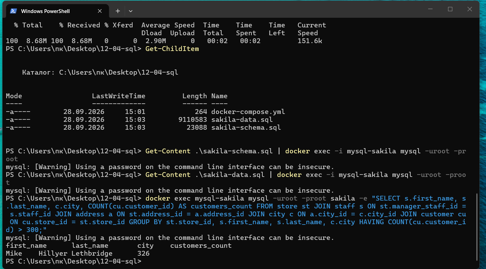
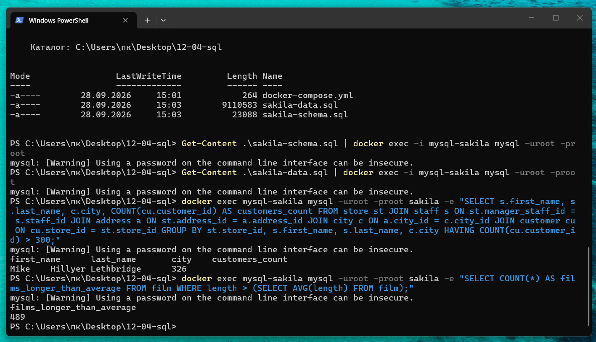
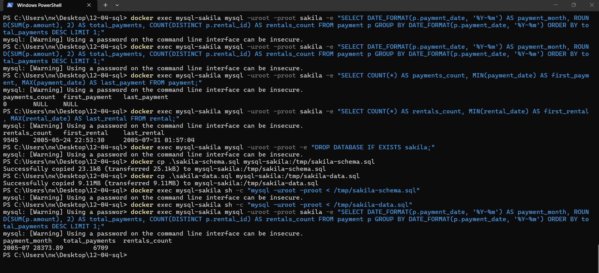

# Домашнее задание к занятию «SQL. Часть 2»


**Выполнил: Павел Чернов**


## Задание 1


Нужно было получить информацию о магазине, в котором обслуживается более 300 покупателей.


Использовал запрос:


```sql

SELECT

    s.first_name,

    s.last_name,

    c.city,

    COUNT(cu.customer_id) AS customers_count

FROM store st

JOIN staff s ON st.manager_staff_id = s.staff_id

JOIN address a ON st.address_id = a.address_id

JOIN city c ON a.city_id = c.city_id

JOIN customer cu ON cu.store_id = st.store_id

GROUP BY

    st.store_id,

    s.first_name,

    s.last_name,

    c.city

HAVING COUNT(cu.customer_id) > 300;

```


В результате получил:


`Mike Hillyer — Lethbridge — 326 покупателей`





## Задание 2


Нужно было получить количество фильмов, продолжительность которых больше средней продолжительности всех фильмов.


Использовал запрос:


```sql

SELECT COUNT(*) AS films_longer_than_average

FROM film

WHERE length > (

    SELECT AVG(length)

    FROM film

);

```


Результат:


`489`





## Задание 3


Нужно было найти месяц, в котором была получена максимальная сумма платежей, и вывести количество аренд за этот месяц.


Использовал запрос:


```sql

SELECT

    DATE_FORMAT(p.payment_date, '%Y-%m') AS payment_month,

    ROUND(SUM(p.amount), 2) AS total_payments,

    COUNT(DISTINCT p.rental_id) AS rentals_count

FROM payment p

GROUP BY DATE_FORMAT(p.payment_date, '%Y-%m')

ORDER BY total_payments DESC

LIMIT 1;

```


В результате получил:


- месяц: `2005-07`;

- сумма платежей: `28373.89`;

- количество аренд: `6709`.




